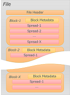

# File layout
This section is about MDS file layout.

# Overview

The file layout of MDS is as shown below.

## File

It consists of multiple blocks.
Processing is performed in units of this block.

The file stores meta information in the header.
It consists of block size and class information for reading blocks.

## Block

A block holds multiple Spreads.
Spread is converted to ColumnBinary.
Spread is kept up to the block size limit, and when the block size is over it is filled with NULL binary.

Since the class for generating blocks is an interface, it can be changed.
In the current implementation, the block is divided into meta information and data part on Spread.
It also has the index of the entire block as a header.
