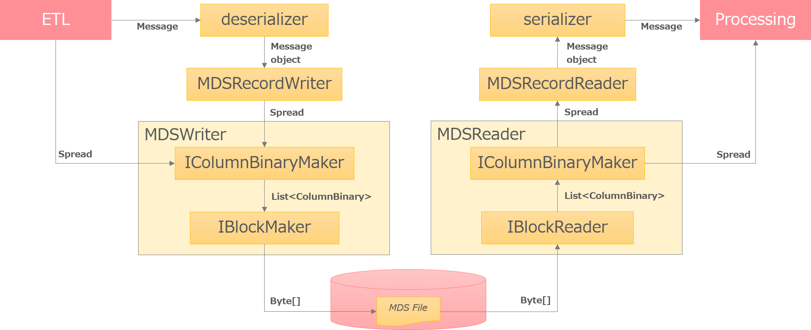
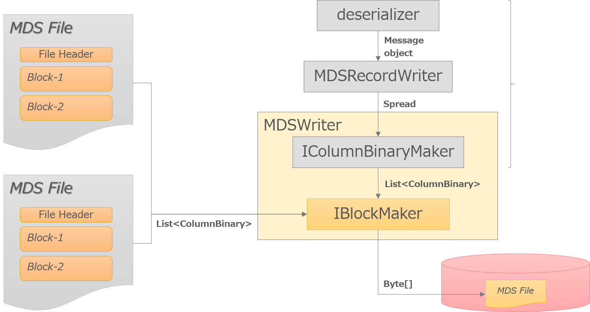
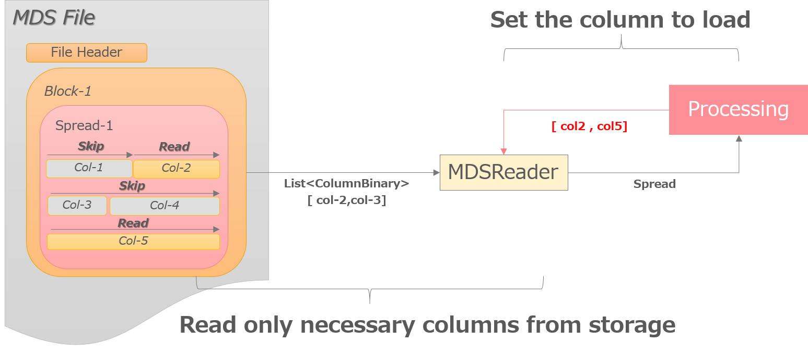
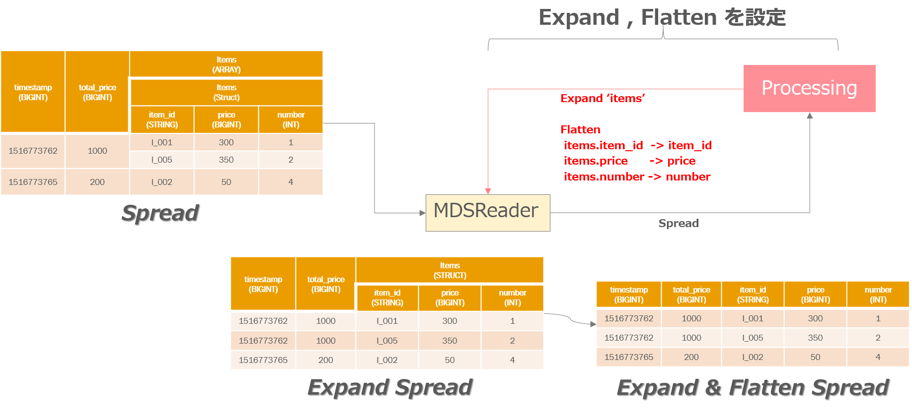

# File layout

The file layout of MDS is as shown below.

## File

It consists of multiple blocks.
Processing is performed in units of this block.

The file stores meta information in the header.
It consists of block size and class information for reading blocks.

## Block

A block holds multiple Spreads.
Spread is converted to ColumnBinary.
Spread is kept up to the block size limit, and when the block size is over it is filled with NULL binary.

Since the class for generating blocks is an interface, it can be changed.
In the current implementation, the block is divided into meta information and data part on Spread.
It also has the index of the entire block as a header.

# Read and write

Input and output of MDS becomes message and Spread.

There is MDSRecordWriter for message input. This puts data in Spread until the number of messages and data size becomes constant, and passes it to MDSWriter.
MDSRecordReader creates an object that provides Spread in units of rows.

MDSWriter converts Spread to binary, generates blocks from binary Spread, and creates files that combine blocks.
MDSReader expands to units of Spread.

## Fast merge of files

MDS does not have a schema, so it is possible to merge in binary state.
When creating a column structure from a message, it consumes a lot of CPU resources such as serialization, encoding and compression.
However, since MDS does not consume these CPU resources, it can solve bottlenecks in disk and network IO.

## Splitable

MDS can split the process in units of blocks.

## Serializing and deserializing Message

MDS uses [dataplatform-schema-lib](https://github.com/yahoojapan/dataplatform-schema-lib) which is published as OSS for serializing and deserializing messages.
This library provides common operations for messages.
MDS does not implement serialization and deserialization, but manipulates messages using the interface of this library.

## Construct dynamic column structure

The concept of MDS does not require a schema at the time of writing.
Therefore, in MDS, the column structure is created dynamically from the data structure of the message.

We refer to all fields of the message and judge each type.
If a column already exists, substitute it, and if it does not exist, create a new column.

The mechanism for dynamically creating this data structure is used not only for messages but also for expression by merging data structures among Spreads included in blocks.

## Encoding of columns
In MDS, you can change the encoding setting for each column.
Two settings can be set for encoding and compression.
By using this, it is possible to optimize individually, such as lightly compressing data that is frequently referred to, efficiently compressing data with less reference.

As for the encoding of the column, I prepare an interface which analyzes Spread and select method.
By default, we adopt the one estimated to reduce the data size after conversion from multiple encoding methods.

Regarding the selection of the compression method, the cost of referring to data and the accumulation period are required.
External information that is unknown at the time of file conversion is necessary, but I can not think of a good method.
Currently it provides only a mechanism that can be set.

## Pushdown
MDS supports Projection Pushdown and Pridicate Pushdown.
This can improve processing performance and reduce disk and network I/O.

### Projection Pushdown

### Pridicate Pushdown

## Expand complex schema
In MDS, data structure can be changed when reading.
This assumes use when the performance can not be demonstrated in a nested data structure such as a query engine.
Basically, the query engine shows excellent performance in a flat schema.

MDS provides two kinds of functions to make it a flat schema.
The first is the function to expand array.
The second is the function to flatten the nest structure.

By combining expand and flatten, it is possible to express complex data with a simple schema.

### Expand
This function expands when the specified column is array.
For columns other than array, you can access the data by calculating the corresponding line number.

### Flatten
This function moves the specified column to the first level.
Columns that can be moved are other than array.
This is because the row length of Spread is different, so the column length can not be consistent.

