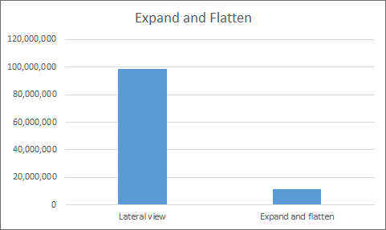
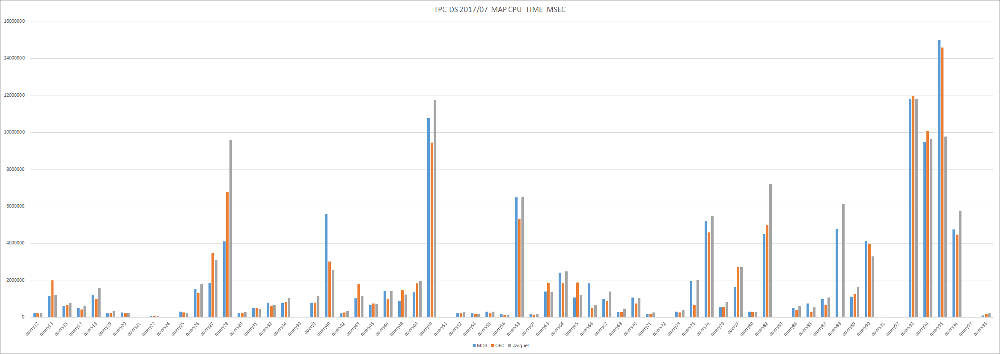

<!---
  Licensed under the Apache License, Version 2.0 (the "License");
  you may not use this file except in compliance with the License.
  You may obtain a copy of the License at

   http://www.apache.org/licenses/LICENSE-2.0

  Unless required by applicable law or agreed to in writing, software
  distributed under the License is distributed on an "AS IS" BASIS,
  WITHOUT WARRANTIES OR CONDITIONS OF ANY KIND, either express or implied.
  See the License for the specific language governing permissions and
  limitations under the License. See accompanying LICENSE file.
-->

## Requirements
Hive 2.0.X

## Support data type

### Numeric Types
| Type       | Supported    |
|:-----------|:------------:|
|TINYINT|**true**|
|SMALLINT|**true**|
|INTEGER|**true**|
|FLOAT|**true**|
|DOUBLE|**true**|
|DECIMAL|**false**|

### Date/Time Types
| Type       | Supported    |
|:-----------|:------------:|
|TIMESTAMP|**false**|
|DATE|**false**|
|INTERVAL|**false**|

### String Types
| Type       | Supported    |
|:-----------|:------------:|
|STRING|**true**|
|VARCHAR|**false**|
|CHAR|**false**|

### Misc Types
| Type       | Supported    |
|:-----------|:------------:|
|BOOLEAN|**true**|
|BINARY|**true**|

### Complex Types
| Type       | Supported    |
|:-----------|:------------:|
|ARRAYS|**true**|
|MAPS|**true**|
|STRUCT|**true**|
|UNION|**true**|

## Support vectorization
Supports primitive type only

## Support pushdown

It corresponds to both predicate pushdown and pushdown filter.
However, as for pushdown filter, column binaryization is pluggable, so it is different whether binary is supported.

## jars
- jp_dataplatform_config.jar
- jp_dataplatform_schema_common.jar
- jp_dataplatform_schema_hive.jar
- jp_dataplatform_schema_jackson.jar
- dataplatform_mds_common.jar
- dataplatform_mds_hive.jar
- dataplatform_mds_schema.jar

## Setup Hive
See [Apache Hive](https://hive.apache.org/)

## Add jars
```
add jar jp_dataplatform_config.jar;
add jar jp_dataplatform_schema_common.jar;
add jar jp_dataplatform_schema_hive.jar;
add jar jp_dataplatform_schema_jackson.jar;
add jar dataplatform_mds_common.jar;
add jar dataplatform_mds_hive.jar;
add jar dataplatform_mds_schema.jar;
```

## Create table
```
create table sample(
  name string,
  price bigint
)
ROW FORMAT SERDE
  'jp.co.yahoo.dataplatform.mds.hadoop.hive.MDSSerde'
STORED AS INPUTFORMAT
  'jp.co.yahoo.dataplatform.mds.hadoop.hive.io.MDSHiveLineInputFormat'
OUTPUTFORMAT
  'jp.co.yahoo.dataplatform.mds.hadoop.hive.io.MDSHiveParserOutputFormat'
```
## Make complicated data correspond to vectorization
Supports array expansion


Supports flattening Map and Struct types


Array expansion and flattening


### TBLPROPERTIES Bug
MR job that MR does not run can not acquire MapWork, so the setting will not be valid.

I want to know how to acquire MapWork.

[Code](../src/hive/src/main/java/jp/co/yahoo/dataplatform/mds/hadoop/hive/io/HiveReaderSetting.java#L64-L68)

### Base table
```
CREATE EXTERNAL TABLE mds_t(
  `unix_timestamp` bigint,
  `f_map` map<string,string>,
  `f_array` array<struct<key1:string>>
)
ROW FORMAT SERDE
  'jp.co.yahoo.dataplatform.mds.hadoop.hive.MDSSerde'
STORED AS INPUTFORMAT
  'jp.co.yahoo.dataplatform.mds.hadoop.hive.io.MDSHiveLineInputFormat'
OUTPUTFORMAT
  'jp.co.yahoo.dataplatform.mds.hadoop.hive.io.MDSHiveParserOutputFormat'
LOCATION '/tmp/mds_t'
TBLPROPERTIES (
  'mds.expand' = '{
    "base" : {
      "node" : "f_array" ,  "link_name" : "f_expand_array" 
    }
  }'
);
```

### Expand table
This feature is read only.

```
CREATE EXTERNAL TABLE mds_t_expand(
  `unix_timestamp` bigint,
  `f_map` map<string,string>,
  `f_expand_array` struct<key1:string>
)
ROW FORMAT SERDE
  'jp.co.yahoo.dataplatform.mds.hadoop.hive.MDSSerde'
STORED AS INPUTFORMAT
  'jp.co.yahoo.dataplatform.mds.hadoop.hive.io.MDSHiveLineInputFormat'
OUTPUTFORMAT
  'jp.co.yahoo.dataplatform.mds.hadoop.hive.io.MDSHiveParserOutputFormat'
LOCATION '/tmp/mds_t'
TBLPROPERTIES (
  'mds.expand' = '{
    "base" : {
      "node" : "f_array" ,  "link_name" : "f_expand_array" 
    }
  }'
);
```

### Flatten table
This feature is read only.

```
CREATE EXTERNAL TABLE mds_t_flatten(
  `unix_timestamp` bigint,
  `f_map_key1` string,
  `f_map_key2` string,
  `f_array` array<struct<key1:string>>
)
ROW FORMAT SERDE
  'jp.co.yahoo.dataplatform.mds.hadoop.hive.MDSSerde'
STORED AS INPUTFORMAT
  'jp.co.yahoo.dataplatform.mds.hadoop.hive.io.MDSHiveLineInputFormat'
OUTPUTFORMAT
  'jp.co.yahoo.dataplatform.mds.hadoop.hive.io.MDSHiveParserOutputFormat'
LOCATION '/tmp/mds_t_2'
TBLPROPERTIES (
  "mds.flatten" = '[ 
    { "link_name" : "unix_timestamp" , "nodes" : [ "unix_timestamp"] } ,
    { "link_name" : "f_array" , "nodes" : [ "f_array"] } ,
    { "link_name" : "f_map_key1" , "nodes" : [ "f_map" , "key1"] } ,
    { "link_name" : "f_map_key2" , "nodes" : [ "f_map" , "key2"] } 
  ]'
);
```

### Expand and Flatten table
This feature is read only.

```
CREATE EXTERNAL TABLE mds_t_expand_flatten(
  `unix_timestamp` bigint,
  `f_map_key1` string,
  `f_map_key2` string,
  `f_expand_array_key1` string
)
ROW FORMAT SERDE
  'jp.co.yahoo.dataplatform.mds.hadoop.hive.MDSSerde'
STORED AS INPUTFORMAT
  'jp.co.yahoo.dataplatform.mds.hadoop.hive.io.MDSHiveLineInputFormat'
OUTPUTFORMAT
  'jp.co.yahoo.dataplatform.mds.hadoop.hive.io.MDSHiveParserOutputFormat'
LOCATION '/tmp/mds_t_2'
TBLPROPERTIES (
  'mds.expand' = '{
    "base" : {
      "node" : "f_array" ,  "link_name" : "f_expand_array" 
    }
  }',
  "mds.flatten" = '[ 
    { "link_name" : "f_expand_array_key1" , "nodes" : [ "f_expand_array" , "key1"] } ,
    { "link_name" : "unix_timestamp" , "nodes" : [ "unix_timestamp"] } ,
    { "link_name" : "f_map_key1" , "nodes" : [ "f_map" , "key1"] } ,
    { "link_name" : "f_map_key2" , "nodes" : [ "f_map" , "key2"] } 
  ]'
);
```

### Performance
Measure processing speed with very complicated log data.

About 500 GB with Gzip compression

Version 2.0.0

Hive on tez



```
Lateral view
----------------------------------------------------------------------------------------------
  VERTICES   DURATION(ms)  CPU_TIME(ms)  GC_TIME(ms)  INPUT_RECORDS  OUTPUT_RECORDS
----------------------------------------------------------------------------------------------
     Map 1      272029.00    98,781,530    2,399,386  1,086,932,934         194,236
 Reducer 2       71392.00       746,700       17,408        194,236             381
 Reducer 3        1072.00         3,800           24            381               0
----------------------------------------------------------------------------------------------
 
Expand and flatten
----------------------------------------------------------------------------------------------
  VERTICES   DURATION(ms)  CPU_TIME(ms)  GC_TIME(ms)  INPUT_RECORDS  OUTPUT_RECORDS
----------------------------------------------------------------------------------------------
     Map 1       81328.00    11,281,810      208,822 21,509,301,388          96,809
 Reducer 2       17627.00       652,470       18,826         96,809             381
 Reducer 3        1258.00         3,260            0            381               0
----------------------------------------------------------------------------------------------

```

## Benchmark
Version 2.0.0

Hive on tez

TCP-DS scale 500


